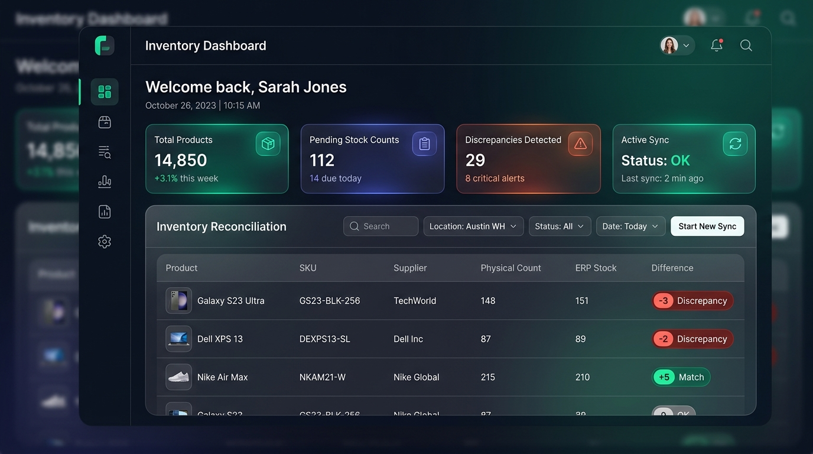

[](https://www.gitguard.com.br/yansilva)


# 📦 Inventory Management System (SaaS)

<div align="center">


**Plataforma SaaS Multi-Tenant corporativa para reconciliação de estoques, contagem física e auditoria de inventário em tempo real integrada a ERPs.**

[Demo Ao Vivo](#-acesso-rápido--modo-demonstração) • [Arquitetura](#-arquitetura-do-sistema) • [Segurança](#-segurança--autenticação) • [Instalação](#-instalação--execução-local) • [Swagger API](#-documentação-da-api-swagger)

---



</div>

---

## 🎯 Sobre o Projeto

O **Inventory Management System** é uma solução SaaS completa desenhada para empresas do comércio varejista e centros de distribuição que enfrentam divergências entre o estoque físico e os registros do ERP (Tiny ERP, Bling, etc.).

A aplicação permite que equipes de loja executem contagens físicas guiadas por leitor de código de barras ou manual, enquanto compara automaticamente com a base de produtos em estoque, destacando faltas, sobras, acurácia percentual e emitindo relatórios executivos em planilhas **Excel (.xlsx)** formatadas.

### 🌟 Destaques de Engenharia & Portfólio

- 🏢 **Arquitetura Multi-Tenant com Isolamento Rígido:** Todas as consultas e mutações são protegidas por contexto de tenant extraído do token criptográfico (`WHERE empresa_id = $n`), impedindo vazamento cruzado de dados.
- 🔐 **Autenticação Avançada com Rotação de Refresh Tokens:** Implementação de tokens de curta duração (15m) e Refresh Tokens opacos armazenados em banco exclusivamente em formato **SHA-256**, com algoritmo ativo de **Detecção de Reúso / Roubo de Sessão**.
- ⚡ **Zero N+1 Queries no PostgreSQL:** Consultas agregadas de alta performance construídas com funções nativas `json_agg()` e `json_build_object()`.
- 🛡️ **Validação de Entrada Rigorosa com Zod:** Sanitização e verificação de tipos em 100% dos endpoints (body, query e params) com respostas de erro RFC-compliant padronizadas.
- 🎨 **Frontend Modular Moderno:** Interface sem frameworks pesados, dividida em módulos desacoplados de CSS (`global`, `components`, `layout`, `pages`) e JS com proteção nativa contra **XSS**.
- 🐳 **Pronto para Produção com Docker & CI/CD:** Imagens multi-stage enxutas, `docker-compose.yml` orquestrado com PostgreSQL 16, healthchecks e pipeline automatizado no GitHub Actions.

---

## 🏛️ Arquitetura do Sistema

```
                      ┌────────────────────────────────────────┐
                      │    Navegador Web / SPA Client          │
                      │  (Vanilla JS Moderno, CSS Modular)     │
                      └──────────────────┬─────────────────────┘
                                         │ HTTPS / REST (JSON)
                                         ▼
┌──────────────────────────────────────────────────────────────────────────────────┐
│                             BACKEND EXPRESS.JS 4                                 │
│                                                                                  │
│  [Rate Limiting] ──► [Helmet Security Headers] ──► [CORS Restritivo]             │
│                                                                                  │
│  [Rotas da Aplicação]                                                            │
│    ├── /api/auth          (Login, Refresh com Rotação, Logout, Guest Sandbox)   │
│    ├── /api/produtos      (CRUD, Catálogo, Importação Excel mesclar/substituir)  │
│    ├── /api/contagens     (Registro, Divergências, Agrupamentos JSON nativos)    │
│    ├── /api/relatorios    (Exportação de Planilhas Excel com ExcelJS)            │
│    ├── /api/docs          (Swagger UI OpenAPI 3.0 interativo)                    │
│    └── /health            (Health Check com sonda de conexão ao banco)           │
│                                                                                  │
│  [Middlewares de Segurança]                                                      │
│    ├── auth.js            (Validação JWT + Bloqueio de Tenants Suspensos)        │
│    ├── tenant.js          (Injeção de req.empresaId imutável)                    │
│    ├── gestor.js          (Controle de Acesso RBAC para funções sensíveis)       │
│    └── validate.js        (Validação e Tipagem de Entradas com Zod)              │
│                                                                                  │
│  [Central Error Handler] (Tratamento operacional RFC: AppError, Zod, Postgres)  │
└────────────────────────────────────────┬─────────────────────────────────────────┘
                                         │ Pool com Conexões Reutilizáveis (pg)
                                         ▼
                      ┌────────────────────────────────────────┐
                      │     PostgreSQL 16 (Multi-Tenant)       │
                      │  TIMESTAMPTZ • CHECK Constraints       │
                      │  SHA-256 Refresh Tokens • Índices B-Tree│
                      └────────────────────────────────────────┘
```

---

## 🔐 Segurança & Autenticação

[](https://www.gitguard.com.br/yansilva)

Auditoria de segurança e conformidade contínua com **GitGuard**, garantindo proteção contra vulnerabilidades em dependências (CVEs), análise estática SAST e conformidade com os padrões OWASP.

### Acesso do funcionário de contagem

O perfil `funcionario` tem uma página inicial própria com **Iniciar nova contagem**, **Catálogo**, **Produtores** e **Histórico de contagens**. Catálogo, produtores e histórico são consultas sem edição ou exportação. O catálogo não informa o saldo do sistema, preservando a contagem cega.

Back-office, sincronização, importação de estoque, gestão de produtos, funcionários e atividades ficam restritos à administração. A navegação bloqueia os atalhos administrativos e a API valida as permissões em cada requisição. O cadastro de empresas é exclusivo do `super_admin`.

### Rotação de Refresh Tokens & Detecção de Roubo

A plataforma implementa a especificação de segurança recomendada pela [RFC 6749 / OWASP](https://owasp.org/):

1. **Hash Criptográfico:** Nenhum refresh token trafegado é salvo em texto claro. O banco guarda apenas o hash SHA-256 (`token_hash VARCHAR(64)`).
2. **Ciclo de Rotação:** A cada requisição em `POST /api/auth/refresh`, o token consumido é revogado imediatamente e um novo par de tokens é retornado.
3. **Detecção de Reúso (Theft Detection):** Se um token revogado for enviado novamente (indício clássico de que foi interceptado por um invasor antes do usuário legítimo), o sistema **invalida instantaneamente todas as sessões ativas** daquele usuário, obrigando nova autenticação.

```
Cliente legítimo ───► POST /api/auth/refresh [Token A] ───► Gera [Token B] & Revoga [Token A]
Invasor (reúso)  ───► POST /api/auth/refresh [Token A] ───► ALERTA: Revoga TODAS as sessões do usuário!
```

---

## 🚀 Acesso Rápido — Modo Demonstração

Para avaliar a aplicação sem necessidade de configurar um banco de dados local imediatamente:

1. Inicie a aplicação via Docker ou Node.
2. Na tela de login, clique no botão **"Entrar como Convidado (Modo Demonstração)"**.
3. A API emitirá um token de sessão isolado para a **Loja Demo**, com dados pré-populados de fornecedores e produtos para simular conferências completas.

> **Credenciais de Administrador Padrão (Seed):**
> - **E-mail:** `admin@demo.com`
> - **Senha:** `AdminDemo@2026!`

---

## 🛠️ Tecnologias Utilizadas

| Camada | Tecnologia | Descrição |
|---|---|---|
| **Runtime** | Node.js 20.x | Ambiente de execução escalável e assíncrono |
| **Framework Web** | Express.js 4.19 | Roteamento REST e arquitetura modular de middlewares |
| **Banco de Dados** | PostgreSQL 16 | Banco relacional com JSONB, constraints e índices otimizados |
| **Validação** | Zod 3.23 | Validação de schemas e inferência de tipos em runtime |
| **Documentação** | Swagger UI / OpenAPI 3.0 | Interface interativa para exploração dos endpoints |
| **Segurança** | bcryptjs, jsonwebtoken, helmet, express-rate-limit | Criptografia, limitação de taxa e headers defensivos |
| **Relatórios** | ExcelJS | Geração dinâmica de planilhas formatadas com estilos |
| **Testes** | Jest & Supertest | Suíte de testes unitários e de integração de rotas |
| **Qualidade** | ESLint & Prettier | Padronização e formatação rigorosa de código |
| **DevOps** | Docker, Docker Compose, GitHub Actions | Conteinerização e integração contínua automatizada |

---

## 💻 Instalação & Execução Local

### Pré-requisitos
- Node.js 20+ instalado
- PostgreSQL 16 ou Docker

### Opção 1: Execução com Docker (Recomendado)

Clone o repositório e suba todo o ecossistema (PostgreSQL + Migrations + Seed + Backend + Frontend) com apenas um comando:

```bash
# Clonar o repositório
git clone https://github.com/yansilva/Sistema-de-contagem-.git
cd Sistema-de-contagem-

# Iniciar containers orquestrados
docker compose up --build -d

# Visualizar logs em tempo real
docker compose logs -f api
```

Acesse no navegador:
- **Aplicação:** [http://localhost:3002](http://localhost:3002)
- **Documentação Swagger:** [http://localhost:3002/api/docs](http://localhost:3002/api/docs)
- **Healthcheck:** [http://localhost:3002/health](http://localhost:3002/health)

---

### Opção 2: Execução Manual (Desenvolvimento)

```bash
# 1. Navegue até o backend
cd backend

# 2. Instale as dependências
npm install

# 3. Configure as variáveis de ambiente
cp .env.example .env
# Edite as credenciais do PostgreSQL no arquivo .env se necessário

# 4. Crie o banco estoque_db no PostgreSQL e aplique sql/schema.sql
# em um banco novo. Para bancos existentes, use as migrations aplicáveis.
# Configure SUPER_ADMIN_EMAIL, SUPER_ADMIN_SENHA e SUPER_ADMIN_NOME no .env.
npm run seed:superadmin

# 5. Inicie em modo de desenvolvimento
npm run dev
```

---

### Erro ao iniciar: `EADDRINUSE` na porta 3002

Esse erro significa que outro processo já está usando a porta do servidor. Se uma instância do sistema já estiver rodando, acesse [http://localhost:3002](http://localhost:3002) sem iniciar novamente.

Para identificar o processo no Windows:

```powershell
netstat -ano | findstr :3002
# Use o PID da linha LISTENING no comando abaixo:
Get-Process -Id <PID>
```

Para reiniciar o sistema, encerre a instância anterior com `Ctrl+C` no terminal em que ela foi iniciada e execute novamente `iniciar-servidor.bat` ou `npm start` na pasta `backend`. Se estiver usando Docker, encerre o serviço com `docker compose stop api` antes de iniciar o backend manualmente.

### Primeiro acesso e cadastro de empresas

1. Com o PostgreSQL conectado e o schema aplicado, execute `npm run seed:superadmin` no backend. O script lê as credenciais do `.env`, cria a organização interna e o usuário de plataforma em uma transação. Reexecutar o script preserva a senha de uma conta já existente.
2. Entre com o email e a senha definidos em `SUPER_ADMIN_EMAIL` e `SUPER_ADMIN_SENHA`.
3. Clique em **Nova empresa**. Informe a empresa, o nome e email do administrador e uma senha temporária forte. Sua sessão de superadmin é preservada.
4. O administrador da empresa entra com a senha temporária e define sua própria senha antes de acessar os dados.

`POST /api/empresas` exige `super_admin` e grava empresa, administrador e auditoria na mesma transação. O cadastro público permanece desabilitado por padrão (`ALLOW_PUBLIC_REGISTRATION=false`).

### Banco local e diagnóstico de conexão

O sistema operacional usa PostgreSQL; o banco em memória é exclusivo dos testes. Quando o PostgreSQL fica indisponível, a API retorna `503 BANCO_INDISPONIVEL` e `/api/health` responde `503` com `database: unreachable`, sem consultar uma base temporária vazia.

Neste ambiente Windows, os binários locais ficam em `.local/pgsql`, e os dados persistentes em `.local/pgdata`. `npm start` e `npm run dev` iniciam essa instalação local quando ela está preparada e o `.env` aponta para `localhost:5432`. Instalações em outros computadores precisam preparar o PostgreSQL ou usar Docker. Os binários para Windows estão disponíveis na [página oficial indicada pelo PostgreSQL](https://www.postgresql.org/download/windows/).

A pasta `.local` e o `.env` ficam fora do Git. Preserve os dados e mantenha backups com `pg_dump`; clonar o repositório não copia empresas, usuários ou contagens. Os logs locais do banco ficam em `.local/postgres.log`.

---

## 🧪 Testes Automatizados & Qualidade de Código

A aplicação conta com suíte automatizada de testes cobrindo autenticação, isolamento multi-tenant, sanitização Zod, RBAC e integridade de rotas:

```bash
# Executar todos os testes com Jest
cd backend
npm test

# Executar testes com relatório de cobertura de código
npm test -- --coverage

# Executar linter (ESLint)
npm run lint

# Formatar o código (Prettier)
npm run format
```

---

## 📖 Documentação da API (Swagger)

A API possui documentação OpenAPI 3.0 navegável e testável diretamente pelo navegador em:
👉 **`http://localhost:3002/api/docs`**

### Principais Endpoints

| Método | Endpoint | Proteção | Descrição |
|---|---|---|---|
| `POST` | `/api/auth/login` | Público | Autenticação com e-mail e senha, retorna access + refresh token |
| `POST` | `/api/auth/refresh` | Público | Rotação atômica de refresh token com detecção de roubo |
| `GET` | `/api/auth/guest` | Público | Emite sessão para a sandbox oficial da Loja Demo |
| `POST` | `/api/auth/logout` | Autenticado | Revoga tokens ativos da sessão do usuário |
| `GET` | `/api/produtos` | JWT | Lista catálogo com paginação e busca por termo/fornecedor |
| `POST` | `/api/produtos` | Gestor | Cadastra novo produto no catálogo do tenant |
| `POST` | `/api/produtos/importar` | Gestor | Importa catálogo em lote com modos `mesclar` ou `substituir` |
| `POST` | `/api/contagens` | JWT | Grava nova contagem com apuração e divergências |
| `GET` | `/api/contagens` | JWT | Consulta histórico de conferências e acurácia |
| `GET` | `/api/relatorios/excel` | JWT | Gera planilha Excel das divergências do dia |
| `GET` | `/health` | Público | Verifica status operacional e conectividade do PostgreSQL |

---

## 📂 Estrutura de Pastas

```
├── .github/
│   └── workflows/
│       └── ci.yml                 # Pipeline GitHub Actions (Testes + Lint)
├── backend/
│   ├── sql/
│   │   ├── schema.sql             # Definição DDL do banco (TIMESTAMPTZ, constraints, índices)
│   │   └── seed.sql               # População inicial e usuário de testes
│   ├── src/
│   │   ├── config/                # Conexão Pool Postgres e JWT com SHA-256
│   │   ├── controllers/           # Lógica de negócio (Auth, Produtos, Contagens, Relatórios)
│   │   ├── docs/                  # Especificação Swagger / OpenAPI 3.0
│   │   ├── errors/                # Classes customizadas AppError e códigos RFC
│   │   ├── middlewares/           # Auth, RBAC Gestor, Tenant, Zod Validate, ErrorHandler
│   │   ├── routes/                # Roteamento Express desacoplado
│   │   ├── services/              # Serviços auxiliares (Geração de Excel formatado)
│   │   ├── validators/            # Schemas de validação estrita com Zod
│   │   ├── app.js                 # Configuração do Express, CORS, Swagger e estáticos
│   │   └── server.js              # Inicialização e graceful shutdown
│   ├── tests/                     # Testes de integração (Auth, Multitenancy, Produtos, Health)
│   ├── Dockerfile                 # Multi-stage build Node 20
│   └── eslint.config.js           # Configuração moderna flat do ESLint
├── docs/
│   └── images/                    # Mockups visuais e diagramas do portfólio
├── frontend/
│   ├── css/                       # Estilização modular moderna (design tokens, layout, pages)
│   ├── js/                        # Módulos JS (API client com auto-refresh, Auth, Contagens)
│   └── index.html                 # Shell HTML semântico com SRI e sem scripts inline
├── docker-compose.yml             # Orquestração completa de containers
├── IMPROVEMENTS.md                # Registro analítico de melhorias e refatorações
└── README.md                      # Documentação executiva do repositório
```

---

## 👨‍💻 Autor & Licença

Desenvolvido por **Yan Silva**.  
Focado em Engenharia de Software Moderna, Arquitetura Limpa, Segurança Defensiva e Aplicações SaaS de Alto Desempenho.

Distribuído sob a licença [MIT](LICENSE).
